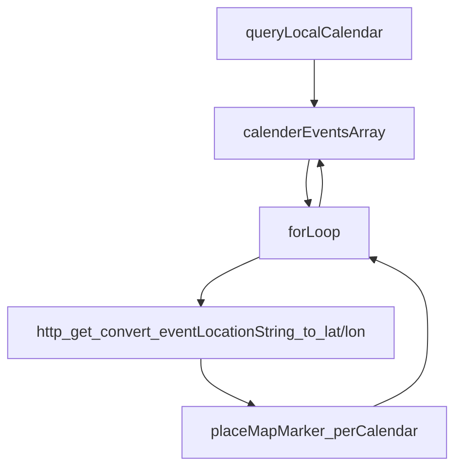

# TomTom Global Student Hackathon 2022

### About

This application was created for the TomTom Global Hackathon. Our team with name "Connected", consisted of Ferry Ras, Carlo Wesseling, Carien Caljouw and Quentin Beukelman. **For this challenge we won the hacker-level first prize (€2500,-) [- certificate](https://github.com/f-ras/TomTom-Hackathon-2022/blob/master/Certificate%20Hacker%20Level%20Prize%20Ferry%20Ras.pdf).**

> **How can TomTom better connect navigation with the user’s digital life?**
> We often need to (safely) use our phones on the go. In this challenge, you’ll find ways of connecting some of the most regularly used apps with a car’s navigation system.

> **Assignment**
> Using our SDKs and APIs, build a simple to use tap-and-go application that connects a daily used platform to a vehicle companion app or a navigation app like TomTom GO Navigation or TomTom AmiGO.
<br />


# Results

### Day 1
#### Mentor Check-in

We were able to connect with our mentor but communication was fragmented from both sides. Later, on day 3, we were able to discuss our project in more detail with our mentor. He was not able to provide technical support, but was able to elaborate on TomTom's current situation and available technologies. Wherein, the mentor explaind the utility of map profiles, whcih fed into our PPOI idea.

#### Brainstorming Session

After analysing the core problem and available resources, our team shared possible solutions. We idnetified the follwoing core problems.

> - TomTom wishes to add value to the Automotive CockPit, which is not available on a mobile phone. Making the CockPit more attractive for drivers than their mobile phones.
> - With the TomTom map, POI's are too neumoerous, making them irrelevant. 

From this, two ideas were not eliminated:

> - Personal Points of Interest(PPOI), "A PPOI is not a place, but what you do at that location".
> - An application programming interface for third parties to query and add PPOIs.

The general idea is to create an application that will display PPOIs as `markers` above the TomTom map. We chose to use calander event locations as an example of how a third party would be able to use our proposed API structure to populate PPOIs.

### Day 2

Our team was able to configure and run the `TomTom Digital Cockpit` application using the `AutomotiveAndroidEmulator` in AndroidStudio, following the tutorial [tomtom-digital-cockpit/documentation](https://developer.tomtom.com/tomtom-digital-cockpit/documentation/getting-started/introduction). Often the emulator in AndroidStudio was slow to load, making development time consuming.

### Day 3

After neumerous stebacks installation of the provided `IVI Service` for Android, our team decided to implement our example with Swift. We completed the following tasks:

- Query the native iOS calander for a string contining calander event locations.
- Access the GeoCoding API with a http GET reques, returning geo-coordinates.
- Display these locations on the map.
- Create a possible structure for a new API for third parties to add PPOIs.
<br />


# Use Case

### What does the app do?

An application that will display PPOIs as `markers` above the TomTom map; wherein, calander event locations are presented as an example of how a third party would be able to use our proposed API structure to populate PPOIs.

### Example Situation

> **Calendar app** The user starts the car and a calendar app shows upcoming events on the map as well as recommends a destination.

> **Restaurant app** The car needs to recharge and the app suggests charging at a specific restaurant. Alternatively a friends app could suggest charging  at the same location as a college.
<br />


# Code Overview

### Setup

#### Create a new Swift application

- Create a new Swift application, add your TomTom `API-Key` to the `AppDelegate.swift` and `ViewController.swift`.
- Use the above `ViewController.swift`.

### Used Services

- `iOS Swift EKCalendar`service.
- `TomTomSDKMapDisplay SDK`.
- `TomTomSDKMapMarker SDK`.
- `TomTom GeoCoding API`.

### Architecture

Below is a diagram detailing the general application architecture.


<br />


# Application ScreenShot

> **Black** Event locations within the clendar named `TomTom`

>  **Red** Event locations within the clendar named `TomTom Sport`


<br />


# Supposed API Suggestion

### API Request

#### https format example

```https
  /search/{versionNumber}/dppoiSearch/{query}.{ext}?....
```

#### TomTom PPOI API Diagram


#### Input parameters (in addition to POI parameters)

```https
  - PPOI category to search
  - List of additional ppoi’s
      - 3rd-party ID
      - Category
         - Physical location
          - Person location
             - Friend
             - Colleague
         - Area
    - Dynamic/Static
    - Potential added time to eta
```
<br />


# Remarks and Recomendations

- If developing this API, determine which desired apps to integrate and contract launching developers. We suggest a calendar app as this can assist in generation of the ‘spare time’ metric.
- We suggest personal profiles to personalise presented map data and customise search autocomplete.
- Users should set sharing permissions etc.
- The TomTom documentation was very good, but was missing some relevant system information; namely, that the CockPit does not support Apple Silicon. Also, build times were very long with the TomTom Automotive Emulator.
<br />
