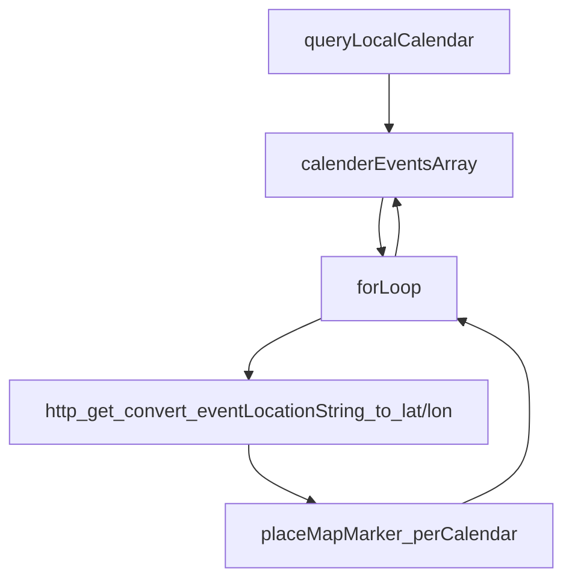

# Personal Points of Interest (PPOI) - TomTom Global Student Hackathon 2022 Winner 🏆

## Award
First Prize Winner (€2,500) - Hacker Level Category  
[View Certificate](https://github.com/f-ras/TomTom-Hackathon-2022/blob/master/Certificate%20Hacker%20Level%20Prize%20Ferry%20Ras.pdf)

## Team "Connected"
- Ferry Ras
- Carlo Wesseling
- Carien Caljouw
- Quentin Beukelman

## Challenge Overview
TomTom posed the question: "How can TomTom better connect navigation with the user's digital life?"

The challenge focused on safely integrating commonly used apps with vehicle navigation systems. We were tasked with building a tap-and-go application that connects daily platforms to vehicle companion apps or navigation apps like TomTom GO Navigation and TomTom AmiGO.

## Our Solution: Personal Points of Interest (PPOI)

### Core Concept
We developed a system that displays Personal Points of Interest (PPOIs) as markers on TomTom maps. Unlike traditional POIs, PPOIs represent activities rather than just locations. We demonstrated this concept by integrating calendar event locations as an example of third-party API integration.

### Key Features
- Integration with iOS Calendar events
- Custom map markers for different calendar categories
- Geocoding of location strings to coordinates
- Proposed API structure for third-party PPOI integration

### Use Cases
1. **Calendar Integration**
   - Displays upcoming events on the map
   - Recommends destinations based on schedule

2. **Smart Suggestions**
   - Suggests charging stations near restaurants
   - Enables social charging recommendations (e.g., charging where friends are located)

## Technical Implementation

### Technologies Used
- iOS Swift EKCalendar
- TomTom SDK Components:
  - MapDisplay SDK
  - MapMarker SDK
  - Geocoding API

### Architecture


### Proposed PPOI API Structure

#### Endpoint Format
```
/search/{versionNumber}/dppoiSearch/{query}.{ext}
```

#### Input Parameters
- PPOI category
- Additional PPOI list:
  - Third-party ID
  - Category types:
    - Physical location
    - Person location (Friend/Colleague)
    - Area
  - Dynamic/Static flag
  - ETA impact estimation

## Development Journey

### Day 1
- Initial mentor consultation
- Problem analysis identifying key challenges:
  - Need to enhance Automotive Cockpit value proposition
  - POI overload issues in current implementation
- Core concept development of PPOI system

### Day 2
- Successfully configured TomTom Digital Cockpit
- Worked with AutomotiveAndroidEmulator in AndroidStudio
- Encountered and managed performance challenges

### Day 3
- Pivoted to Swift implementation
- Completed core functionalities:
  - Calendar integration
  - Geocoding implementation
  - Map marker system
  - API structure design

## Screenshots


**Legend:**
- Black markers: Events from "TomTom" calendar
- Red markers: Events from "TomTom Sport" calendar

## API Design


## Recommendations

### For Implementation
1. Prioritize integration with calendar apps to generate accurate "spare time" metrics
2. Implement personal profiles for map data personalization
3. Develop robust user permission systems

### For Development
1. Consider key third-party apps for initial integration
2. Contract launch developers early in the process
3. Focus on user privacy and data sharing controls

### Technical Notes
- TomTom documentation is comprehensive but needs updates for Apple Silicon compatibility
- Consider optimization for emulator build times
